# CNPM-school-food-festivals

## Sơ đồ hệ thống

### 1. Context Diagram
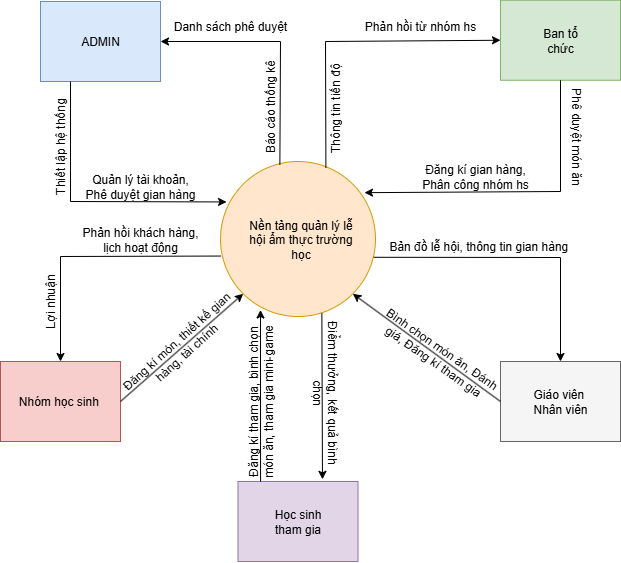

### 2. ERD Diagram

### 3. Use Case Diagram
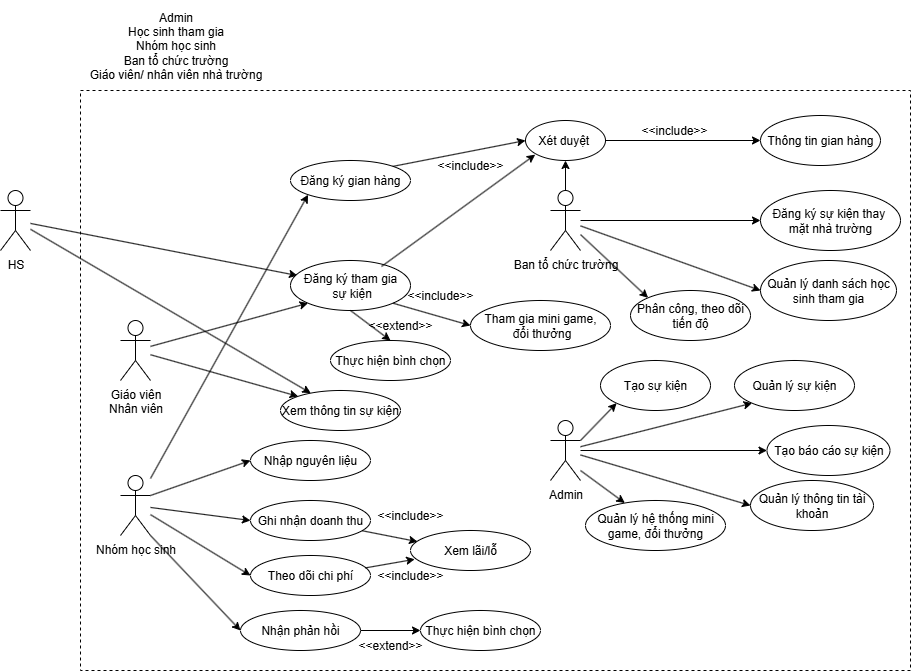

# I. Tổng quan dự án

## Mục tiêu

Xây dựng một **website/app** phục vụ công tác tổ chức **lễ hội ẩm thực học đường** tại trường, cho phép học sinh/nhóm học sinh đăng ký gian hàng & tham gia sự kiện, ban tổ chức quản lý – xét duyệt – phân công – theo dõi tiến độ, giáo viên/nhân viên hỗ trợ giám sát/đánh giá, và admin vận hành hệ thống. Hệ thống cũng hỗ trợ thu thập phản hồi, chấm điểm – xếp hạng gian hàng, báo cáo tổng hợp sau sự kiện.

## Phạm vi

Phạm vi bao gồm các chức năng chính:

* **Quản lý sự kiện** (tạo/sửa/xoá sự kiện, cấu hình thời gian – khu vực – tiêu chí chấm điểm, mini game/đổi thưởng nếu có).
* **Đăng ký tham gia** (đăng ký người tham gia, **đăng ký gian hàng** với mô tả món, nhu cầu dụng cụ/nguyên liệu, số lượng thành viên…).
* **Xét duyệt** (duyệt/ từ chối đăng ký, phản hồi yêu cầu bổ sung, phân công khu vực, theo dõi tiến độ chuẩn bị).
* **Quản lý gian hàng** (cập nhật thông tin, nhập nguyên liệu, theo dõi chi phí, ghi nhận doanh thu, tồn kho đơn giản).
* **Tương tác – truyền thông** (xem thông tin sự kiện, thông báo, lịch, bản đồ gian hàng, mini game/bình chọn công khai…).
* **Bình chọn – đánh giá – phản hồi** (bình chọn của học sinh/khách, phiếu chấm điểm của giáo viên/BTC, phản hồi hai chiều).
* **Báo cáo – xếp hạng** (bảng điểm, top gian hàng theo tiêu chí, lãi/lỗ, thống kê tham gia, nhật ký hoạt động).
* **Quản trị hệ thống** (quản lý tài khoản, phân quyền vai trò, cấu hình tiêu chí, danh mục dịch vụ/dụng cụ mặc định, sao lưu dữ liệu).

## Giả định và ràng buộc

* Hệ thống phục vụ **một trường** hoặc **sự kiện nội bộ** của trường; không nhằm thay thế ERP/CRM quy mô lớn.
* **Không tích hợp thanh toán online**; doanh thu/chi phí do nhóm tự ghi nhận (input thủ công).
* Xét duyệt, phân công và cập nhật tiến độ có thể được **thực hiện thủ công** bởi Ban tổ chức qua giao diện quản trị.
* Hệ thống ưu tiên **web-first**, hỗ trợ mobile responsive; ứng dụng di động là tuỳ chọn.
* Bảo mật ở mức **tài khoản – vai trò**; không xử lý dữ liệu nhạy cảm ngoài phạm vi sự kiện (KHÔNG lưu CMND/CCCD, số tài khoản…).
* Tối ưu cho **tải vừa** (hàng nghìn người dùng nội bộ/truy cập cùng lúc ở mức trung bình khi diễn ra sự kiện).

---

# II. Yêu cầu chức năng

## Các tác nhân (Actor)

Hệ thống có **5 tác nhân** chính:

1. **Guest** (khách/HS chưa đăng nhập) – xem thông tin sự kiện, gian hàng, tham gia bình chọn/mini game (nếu cho phép ẩn danh).
2. **Học sinh tham gia (Customer)** – cá nhân tham dự sự kiện, có thể bình chọn, đăng ký tham gia cá nhân, nhận thông báo.
3. **Nhóm học sinh (Stylist)** – đại diện gian hàng/nhóm thi: quản lý gian hàng, chi phí, doanh thu, tiến độ, phản hồi.
4. **Ban tổ chức trường (Manager)** – xét duyệt, phân công, theo dõi, quản lý sự kiện toàn cục.
5. **Giáo viên/Nhân viên** – giám sát, chấm điểm theo tiêu chí, phản hồi hiện trường.
6. **Admin** – quản trị hệ thống (tài khoản, vai trò, cấu hình, sao lưu).
   *(Ghi chú: Có thể gộp Admin vào Ban tổ chức nếu tổ chức nhỏ.)*

### Code PlantUML (actor diagram)

  

Code PlantUML

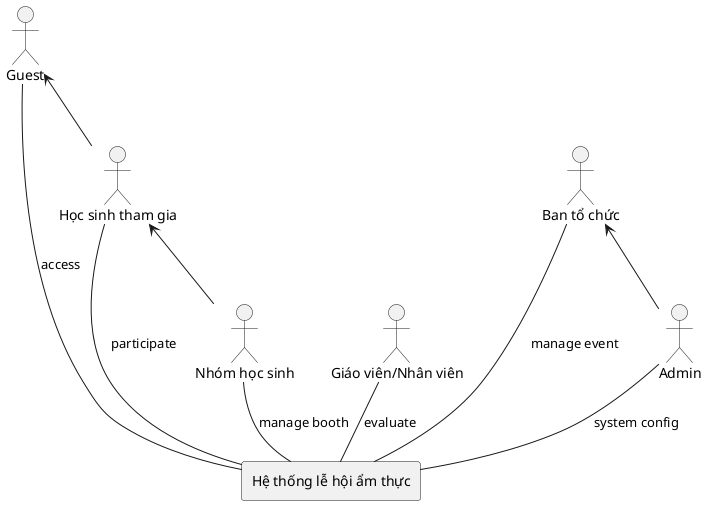

 

## Các chức năng chính

### Guest

* **Tìm kiếm & xem thông tin sự kiện/gian hàng** (mô tả, thời gian, địa điểm, bản đồ gian hàng, nội quy, lịch).
* **Xem bảng xếp hạng/bình chọn công khai** (nếu sự kiện cho phép).
* **Tham gia mini game, bình chọn** (nếu cho phép không đăng nhập hoặc OTP/email xác thực nhanh).
* **Đăng ký/Đăng nhập** để tham gia sâu hơn.

### Học sinh tham gia (Customer)

* **Đăng ký tham gia cá nhân** sự kiện (nhận mã/QR, nhận thông báo).
* **Bình chọn** gian hàng, gửi **phản hồi** cho BTC.
* **Xem lịch sự kiện**, lịch biểu diễn/hoạt động, **nhận thông báo**.
* **Quản lý tài khoản** (cập nhật thông tin, đổi mật khẩu).

### Nhóm học sinh (Team)

* **Đăng ký gian hàng**: thông tin nhóm, món ăn, nhu cầu dụng cụ/nguyên liệu, công suất phục vụ.
* **Cập nhật tiến độ chuẩn bị**: checklist công việc, minh chứng.
* **Quản lý gian hàng**: mô tả, hình ảnh, menu/giá (nếu có), vị trí gian hàng.
* **Ghi nhận doanh thu – chi phí**; **xem lãi/lỗ** cơ bản.
* **Nhập nguyên liệu** & tồn kho đơn giản (tuỳ chọn).
* **Nhận phản hồi** từ BTC/GV, trả lời phản hồi.

### Giáo viên/Nhân viên

* **Xem thông tin sự kiện & phân công**.
* **Chấm điểm** gian hàng theo **bộ tiêu chí** (thang điểm, trọng số) – online/offline.
* **Ghi nhận vi phạm/biên bản** nếu cần.
* **Gửi phản hồi**/đề xuất hỗ trợ cho BTC.

### Ban tổ chức (Manager)

* **Tạo & cấu hình sự kiện**: thời gian, địa điểm, sơ đồ gian hàng, tiêu chí chấm điểm, cấu hình bình chọn/mini game.
* **Xét duyệt** đăng ký tham gia, đăng ký gian hàng; **phản hồi** yêu cầu bổ sung.
* **Phân công** khu vực, lịch trực, nhiệm vụ; **theo dõi tiến độ** các nhóm.
* **Quản lý danh sách** người tham gia; **gửi thông báo** đa kênh (email/app push/QR).
* **Quản lý bình chọn**: thời gian mở/đóng, phát hiện gian lận cơ bản (giới hạn tần suất/IP/OTP).
* **Báo cáo & Xếp hạng**: tổng hợp điểm BGK + bình chọn, bảng xếp hạng theo tiêu chí, export Excel/PDF.

### Admin

* **Quản lý tài khoản & vai trò** (Admin/BTC/Staff/Team/Student/Guest hạn chế).
* **Quản lý danh mục** (tiêu chí chấm điểm mặc định, danh mục dụng cụ/nguyên liệu tham khảo).
* **Cấu hình hệ thống** (logo, tên sự kiện, email server, sao lưu/khôi phục dữ liệu).
 
### Biểu đồ Use Case tổng quanquan

  

Code PlantUML

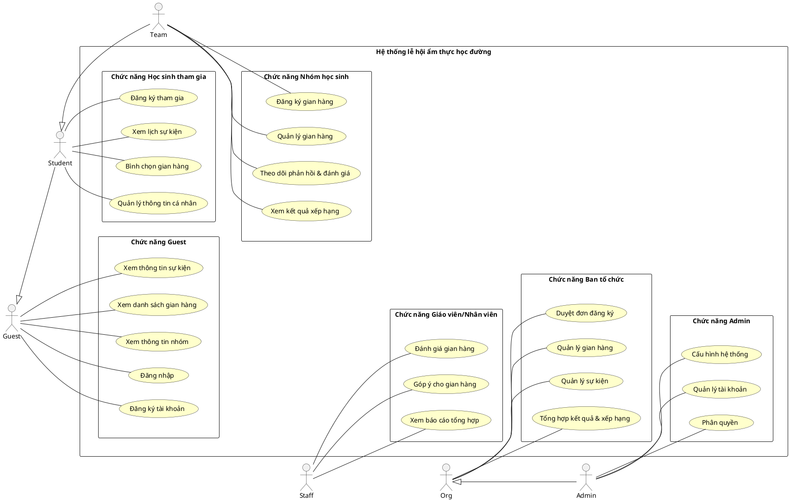

 

![Biểu đồ UML](https://www.plantuml.com/plantuml/png/bLR1Zjn44BtxAqfxI4uZVe13TcPd9qXX2JC9Ga8SEkqUTyjsjzTk3wmW1uGG1uH4X3WWX9GXuX040XIup0Xny8h_y9_GNPvjQXtFCfd3RlkvNtNLg-egtwaiAssTPr6LAbsmakLGLuApIi174S2OyJGfJQtZYSbC2UE7YpVEfej5z3WY36tiyFPxAf5saLwCirfuIYQM5go1qkCGgr9mguoE8iQjspwhHMLtwuMjOw6ldXu8beSNRBdShTygaztgECwLiuCMuFMFHwDWeFk_0z6EO-7J5SbxmNII2JYwssu_1olRxHETGDPkFmEt_bP1ktcU8_uxzyYN72wV_FDRk_rU9qSkyWZSpvf4M2bALABx4SiJHtlEGLz-gfCkq2DW5Ho7tVWBuX-zA_o1pHzkjrKQAdSqfCgvfv7tZX8VJ5T2s_tic6a9LRFc4XB5DCZcgKu2UMoCbTL1PslPlCW3qKkuXtVv5KQdPRlvfK32FPCeVUFcjFaBRFDKGIfDktdMHJSNYQgiA0FpSVI_cjx5j5HAIx2IvJvcj3NUfp1rW19s1KDz69R8rSSNN0wcPi6bYEjC39F7pSzQ0lU5f5_AZR42SpDCVRls8a66JeSCyMRji_H3vy2RJBD4t2_DKcM2I1Y4t2_YcKyro20bsfi41GVLen7GvD4eXYEWnE3t7je3AGp4pPyA2ea6d9DVAxZbBcAprhx4ctMG_rI8-17ZQJIOjxJT_6tXtFi17xfr0SxYcjoDETEfqiaXWitSiGPMglb9ltRcCz2jqTJ9i6x1tNxyqnNBQcRtAJ1hNXJWLEFIz9apjH8tn_p8kydz7zjklz69b-zPyL_4eZ2bhGw9UCmqsW2EQEVvKAGdzOMx4zPtohLsVw_gfUjxHL6QbPYBSzyAgrSf4zU-IQNSJEtVpOv86oSjCQBCjIAvzNAPBEeyP-N5N5HrTfXkE6oGUpgargJT_5Y3nCuWoHJgJhkehCWdHYzLScEyj9EIW8yvDxKUala-rkovJzKdb34tcRWMrcsOEHb_lJAU0EycYmSPFa3gFLQu-nX6xqaLnqA_Fu89GXCAdI1qGg4fGbCAdKRkyDlEew9GNa6SzAjs-vs2XyxvYOjWD_578p8H2HJc7CLmX16e6rBXCJJ-yEdWmFvG8AzelwTuwEG4xFNco7j2pyJz0ILb7Z3QtYWOcbQ47qWExVMJ05zh5W6bNG2_a1pMlwGTtBk00QPtguFwjoJ2Eu0lQ447j5Ui50ybUKVekCwpVm40)

### Biểu đồ Use Case chi tiết
#Chức năng Guest

  

Code PlantUML

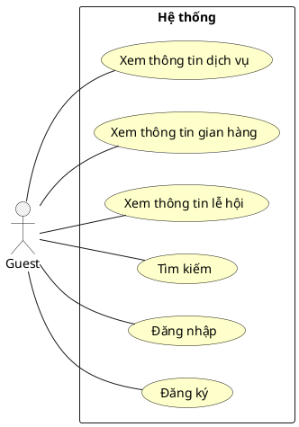

 

#Chức năng Student

  

Code PlantUML

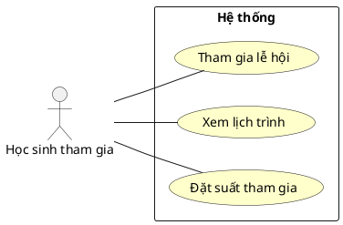

 

#Chức năng Team học sinh

  

Code PlantUML

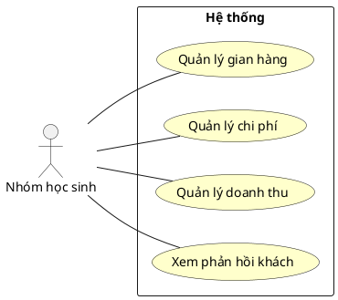

 

#Chức năng Staff

  

Code PlantUML

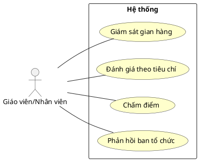

 

#Chức năng Org

  

Code PlantUML

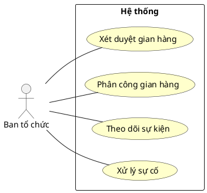

 

#Chức năng Admin

  

Code PlantUML

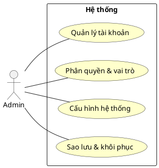

 

### Quy trình hoạt động
Quy trình truy cập hệ thống lễ hội

  

Code PlantUML

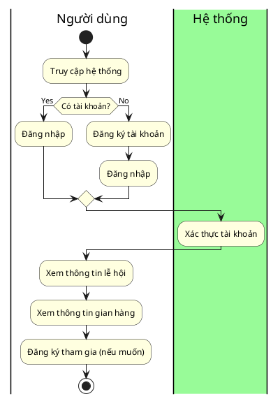

 

Quy trình của học sinh tham gia

  

Code PlantUML

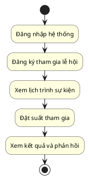

 

Quy trình của nhóm gian hàng 

  

Code PlantUML

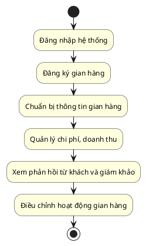

 

Quy trình của giáo viên/giám khảo

  

Code PlantUML

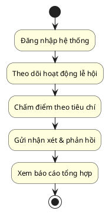

 

Quy trình của ban tổ chức

  

Code PlantUML

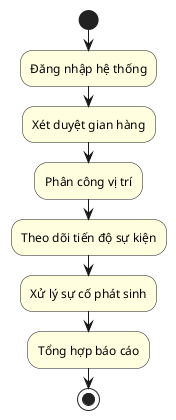

 

Quy trình của quản trị viên

  

Code PlantUML

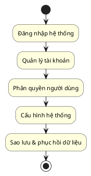

 

