# I. Tổng quan dự án

## Mục tiêu

Xây dựng một **website/app** phục vụ công tác tổ chức **lễ hội ẩm thực học đường** tại trường, cho phép học sinh/nhóm học sinh đăng ký gian hàng & tham gia sự kiện, ban tổ chức quản lý – xét duyệt – phân công – theo dõi tiến độ, giáo viên/nhân viên hỗ trợ giám sát/đánh giá, và admin vận hành hệ thống. Hệ thống cũng hỗ trợ thu thập phản hồi, chấm điểm – xếp hạng gian hàng, báo cáo tổng hợp sau sự kiện.

## Phạm vi

Phạm vi bao gồm các chức năng chính:

* **Quản lý sự kiện** (tạo/sửa/xoá sự kiện, cấu hình thời gian – khu vực – tiêu chí chấm điểm, mini game/đổi thưởng nếu có).
* **Đăng ký tham gia** (đăng ký người tham gia, **đăng ký gian hàng** với mô tả món, nhu cầu dụng cụ/nguyên liệu, số lượng thành viên…).
* **Xét duyệt** (duyệt/ từ chối đăng ký, phản hồi yêu cầu bổ sung, phân công khu vực, theo dõi tiến độ chuẩn bị).
* **Quản lý gian hàng** (cập nhật thông tin, nhập nguyên liệu, theo dõi chi phí, ghi nhận doanh thu, tồn kho đơn giản).
* **Tương tác – truyền thông** (xem thông tin sự kiện, thông báo, lịch, bản đồ gian hàng, mini game/bình chọn công khai…).
* **Bình chọn – đánh giá – phản hồi** (bình chọn của học sinh/khách, phiếu chấm điểm của giáo viên/BTC, phản hồi hai chiều).
* **Báo cáo – xếp hạng** (bảng điểm, top gian hàng theo tiêu chí, lãi/lỗ, thống kê tham gia, nhật ký hoạt động).
* **Quản trị hệ thống** (quản lý tài khoản, phân quyền vai trò, cấu hình tiêu chí, danh mục dịch vụ/dụng cụ mặc định, sao lưu dữ liệu).

## Giả định và ràng buộc

* Hệ thống phục vụ **một trường** hoặc **sự kiện nội bộ** của trường; không nhằm thay thế ERP/CRM quy mô lớn.
* **Không tích hợp thanh toán online**; doanh thu/chi phí do nhóm tự ghi nhận (input thủ công).
* Xét duyệt, phân công và cập nhật tiến độ có thể được **thực hiện thủ công** bởi Ban tổ chức qua giao diện quản trị.
* Hệ thống ưu tiên **web-first**, hỗ trợ mobile responsive; ứng dụng di động là tuỳ chọn.
* Bảo mật ở mức **tài khoản – vai trò**; không xử lý dữ liệu nhạy cảm ngoài phạm vi sự kiện (KHÔNG lưu CMND/CCCD, số tài khoản…).
* Tối ưu cho **tải vừa** (hàng nghìn người dùng nội bộ/truy cập cùng lúc ở mức trung bình khi diễn ra sự kiện).

---

# II. Yêu cầu chức năng

## Các tác nhân (Actor)

Hệ thống có **5 tác nhân** chính:

1. **Guest** (khách/HS chưa đăng nhập) – xem thông tin sự kiện, gian hàng, tham gia bình chọn/mini game (nếu cho phép ẩn danh).
2. **Học sinh tham gia (Customer)** – cá nhân tham dự sự kiện, có thể bình chọn, đăng ký tham gia cá nhân, nhận thông báo.
3. **Nhóm học sinh (Stylist)** – đại diện gian hàng/nhóm thi: quản lý gian hàng, chi phí, doanh thu, tiến độ, phản hồi.
4. **Ban tổ chức trường (Manager)** – xét duyệt, phân công, theo dõi, quản lý sự kiện toàn cục.
5. **Giáo viên/Nhân viên** – giám sát, chấm điểm theo tiêu chí, phản hồi hiện trường.
6. **Admin** – quản trị hệ thống (tài khoản, vai trò, cấu hình, sao lưu).
   *(Ghi chú: Có thể gộp Admin vào Ban tổ chức nếu tổ chức nhỏ.)*

### Code PlantUML (actor diagram)

<details>
  
<summary>Code PlantUML</summary>

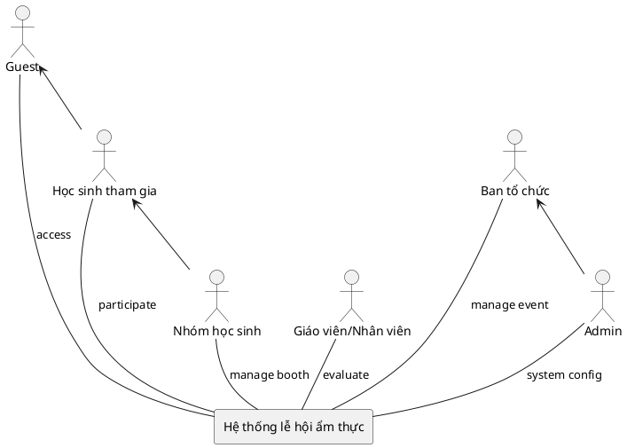
</details> 


## Các chức năng chính

### Guest

* **Tìm kiếm & xem thông tin sự kiện/gian hàng** (mô tả, thời gian, địa điểm, bản đồ gian hàng, nội quy, lịch).
* **Xem bảng xếp hạng/bình chọn công khai** (nếu sự kiện cho phép).
* **Tham gia mini game, bình chọn** (nếu cho phép không đăng nhập hoặc OTP/email xác thực nhanh).
* **Đăng ký/Đăng nhập** để tham gia sâu hơn.

### Học sinh tham gia (Customer)

* **Đăng ký tham gia cá nhân** sự kiện (nhận mã/QR, nhận thông báo).
* **Bình chọn** gian hàng, gửi **phản hồi** cho BTC.
* **Xem lịch sự kiện**, lịch biểu diễn/hoạt động, **nhận thông báo**.
* **Quản lý tài khoản** (cập nhật thông tin, đổi mật khẩu).

### Nhóm học sinh (Team)

* **Đăng ký gian hàng**: thông tin nhóm, món ăn, nhu cầu dụng cụ/nguyên liệu, công suất phục vụ.
* **Cập nhật tiến độ chuẩn bị**: checklist công việc, minh chứng.
* **Quản lý gian hàng**: mô tả, hình ảnh, menu/giá (nếu có), vị trí gian hàng.
* **Ghi nhận doanh thu – chi phí**; **xem lãi/lỗ** cơ bản.
* **Nhập nguyên liệu** & tồn kho đơn giản (tuỳ chọn).
* **Nhận phản hồi** từ BTC/GV, trả lời phản hồi.

### Giáo viên/Nhân viên

* **Xem thông tin sự kiện & phân công**.
* **Chấm điểm** gian hàng theo **bộ tiêu chí** (thang điểm, trọng số) – online/offline.
* **Ghi nhận vi phạm/biên bản** nếu cần.
* **Gửi phản hồi**/đề xuất hỗ trợ cho BTC.

### Ban tổ chức (Manager)

* **Tạo & cấu hình sự kiện**: thời gian, địa điểm, sơ đồ gian hàng, tiêu chí chấm điểm, cấu hình bình chọn/mini game.
* **Xét duyệt** đăng ký tham gia, đăng ký gian hàng; **phản hồi** yêu cầu bổ sung.
* **Phân công** khu vực, lịch trực, nhiệm vụ; **theo dõi tiến độ** các nhóm.
* **Quản lý danh sách** người tham gia; **gửi thông báo** đa kênh (email/app push/QR).
* **Quản lý bình chọn**: thời gian mở/đóng, phát hiện gian lận cơ bản (giới hạn tần suất/IP/OTP).
* **Báo cáo & Xếp hạng**: tổng hợp điểm BGK + bình chọn, bảng xếp hạng theo tiêu chí, export Excel/PDF.

### Admin

* **Quản lý tài khoản & vai trò** (Admin/BTC/Staff/Team/Student/Guest hạn chế).
* **Quản lý danh mục** (tiêu chí chấm điểm mặc định, danh mục dụng cụ/nguyên liệu tham khảo).
* **Cấu hình hệ thống** (logo, tên sự kiện, email server, sao lưu/khôi phục dữ liệu).
 
### Biểu đồ Use Case tổng quan

<details>
  
<summary>Code PlantUML</summary>

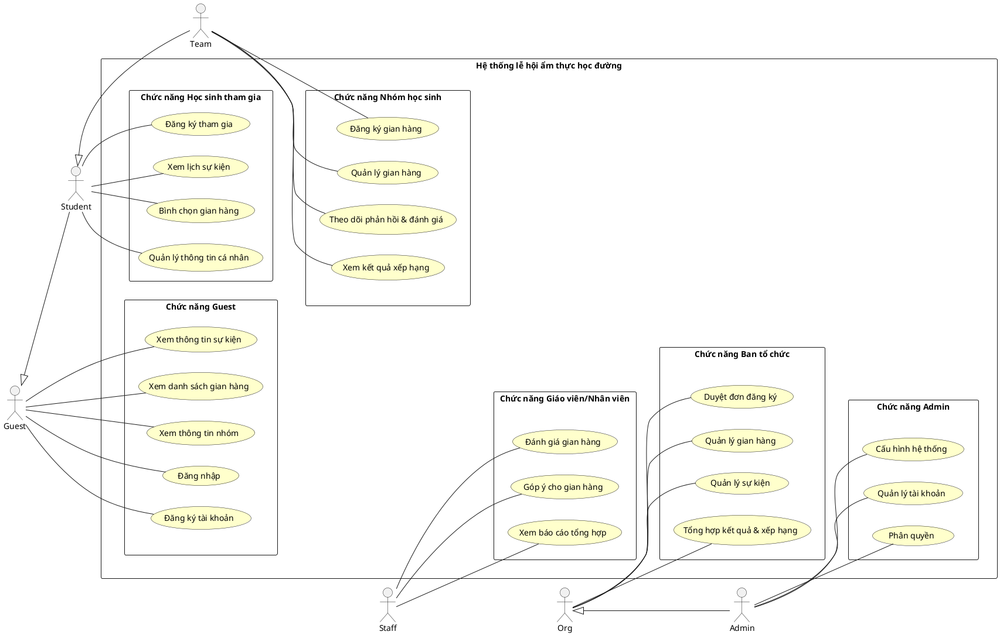
</details> 

![Biểu đồ UML](https://kroki.io/plantuml/svg/eNqVVkFv2zYUvutXPOTQnoL9gR0SO05aoMtaux0GDD2wEi0SlkhForwFWw7DMOwwDGhR9FAUA-oWPaTY0A7dLjaGHRTsf-if9JGUGUqWs8wHmfrE7_G9j-89cq9QJFdlmgR7blTMuMhITlIoCxqSgsK3AcCAhLM4l6WIhjKROQweTG4fjyaT4CzwGEKq_ul3eMzUZHY6SEqqKQmdKlASco1DxHMaKi5FEJBQ4fSjkhaqGU9UGVGxfrtPSeo-kOm0GX-ex81oP0o52jEW4NPvdnedgebfgsYOsuxbQ9JeEBEnFHZu1aufQLF69UTEkNSrHwHHzznUy_PU4H-EGvklhIsn_76vV7-KeAcjx9AB44qpYjQ3StifZ3mItPMQxMUPaNm4uQOkgH1vtv6txd_5kuoFqz9xtuICClwaZhzdE4b3Badfj-Y6vq3siAgGRbUIGcScCGDVS-1tQx5IqVhxrbUFqz6kjqgl3MK7eGyiE6xe_p4Zwh0Zo8JXTZ5Vf4OqXnKYMVkvX9voxjTmhaK5Y54F_6npLbMtBcegFcOkxJiNrcE2hX0HfEKTMBs-bEiE-fEzitu3NZOQ0ahMaD95UP2GXoY6kcTG3mAtmb3pp94rtUiQGKfdDoXVQu_SK-vAZ0SQmN7N5ZR7HpwFnpDbRDzWW91kuJbS2Bt6Cvap14lgLVw7ir4IOkTr9xbafUYlRNVfHDJmDKCTTzncwEKsFkKneLVw8h9SGj3CXhT07tusXv6j4ET7Ad_gOENby4VXG2MisLfF1xHsCJeVMOfVW_HJsd4BOzamDvp1c-524x_NSVIStU2Bo-pDBqhayGSXecTn9OqYH2k3Q_1Q9eoZOo5BvM4uI6aZzFVxnYgHuLK2YfL3PLSe90V6UJ5iTSjdKRcCn-t8sX0vy3I5p2N6olth8X_SBNu3lylXU7u1aYntxnmZYp4yrSS5sZkmkzJNSX46pkWZXE83c9gY7mGfWsN6-abEKHVnYN4pZFc7xYJKh1JMeXxlvBud1Aa8H4Z4KPfJfNfk7Inequ99xlgmtBXWTUyyevVubTzWyWROFgSJecFP6DE3s_dh9yvGI-yjD3dhaKChDx0Y6MCHRgYa-dChvjPcRI-yjGsFzUk_r1cvODxA54cYQXPi42F-eSK2oCZJWpg9whxkDyn36hq_uzpc3ibcN-9Tq9_7uOvkHtjuzYH2xF_Tzl-jfkNcY6325oPrphWYC5JG2_3Ewa1m4VC_C5gbkr4fdYq0gbsF2MB-bTVQp0oCUwPmg5_QDu0kawe3KblHRWRurvb_Iy7Rz-c=)

### Biểu đồ Use Case chi tiết
#Chức năng Guest
<details>
  
<summary>Code PlantUML</summary>

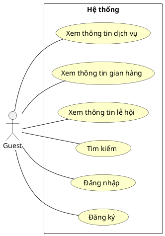
</details> 


#Chức năng Student
<details>
  
<summary>Code PlantUML</summary>

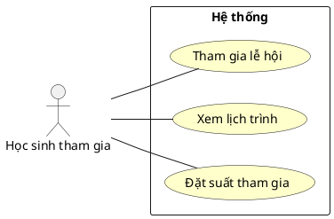
</details> 


#Chức năng Team học sinh
<details>
  
<summary>Code PlantUML</summary>

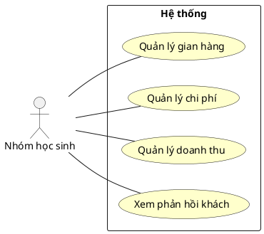
</details> 


#Chức năng Staff
<details>
  
<summary>Code PlantUML</summary>

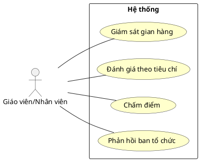
</details> 


#Chức năng Org
<details>
  
<summary>Code PlantUML</summary>

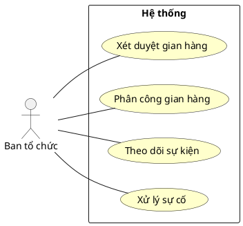
</details> 


#Chức năng Admin
<details>
  
<summary>Code PlantUML</summary>

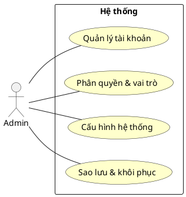
</details> 


### Quy trình hoạt động
Quy trình truy cập hệ thống lễ hội

<details>
  
<summary>Code PlantUML</summary>

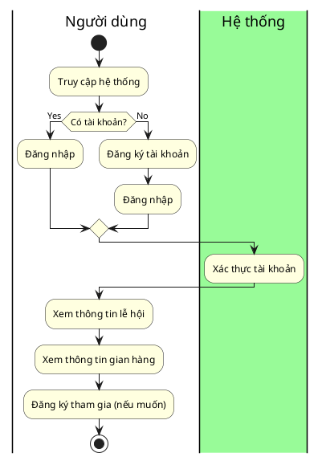
</details> 


Quy trình của học sinh tham gia

<details>
  
<summary>Code PlantUML</summary>

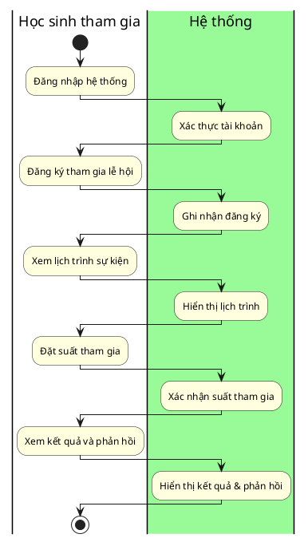
</details> 


Quy trình của nhóm gian hàng 

<details>
  
<summary>Code PlantUML</summary>

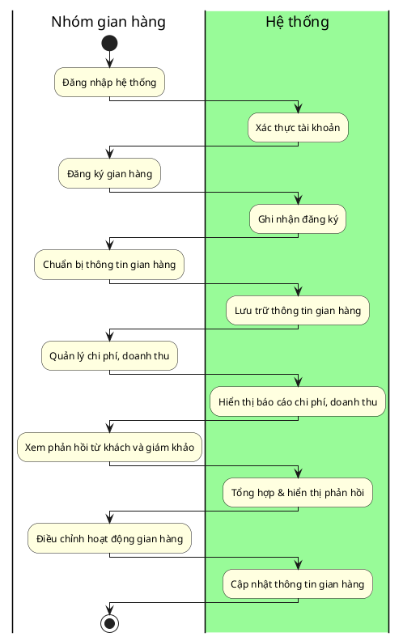
</details> 


Quy trình của giáo viên/giám khảo

<details>
  
<summary>Code PlantUML</summary>

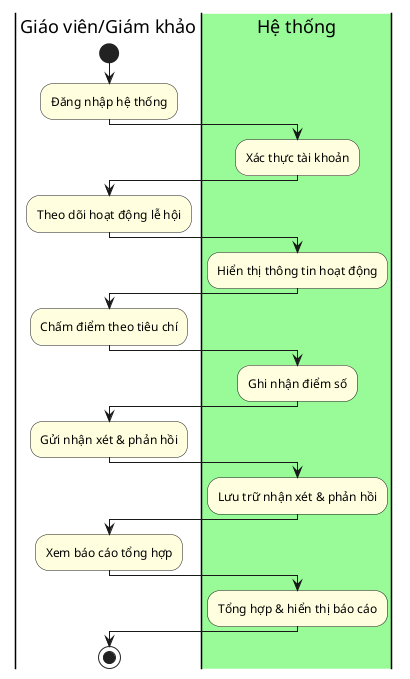
</details> 


Quy trình của ban tổ chức

<details>
  
<summary>Code PlantUML</summary>

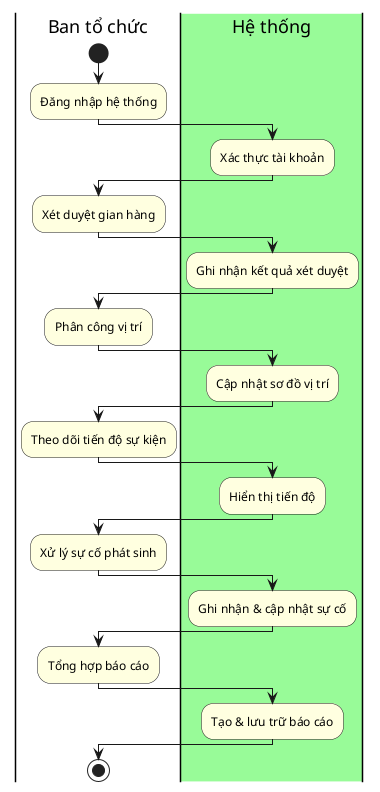
</details> 


Quy trình của quản trị viên

<details>
  
<summary>Code PlantUML</summary>

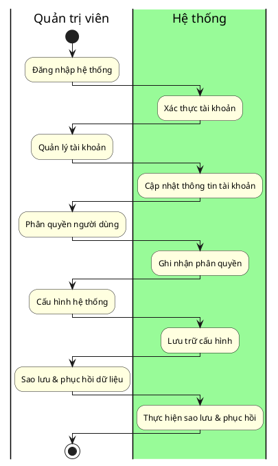
</details> 


### Luồng xử lí
Luồng xử lí đăng kí và đăng nhập

<details>
  
<summary>Code PlantUML</summary>

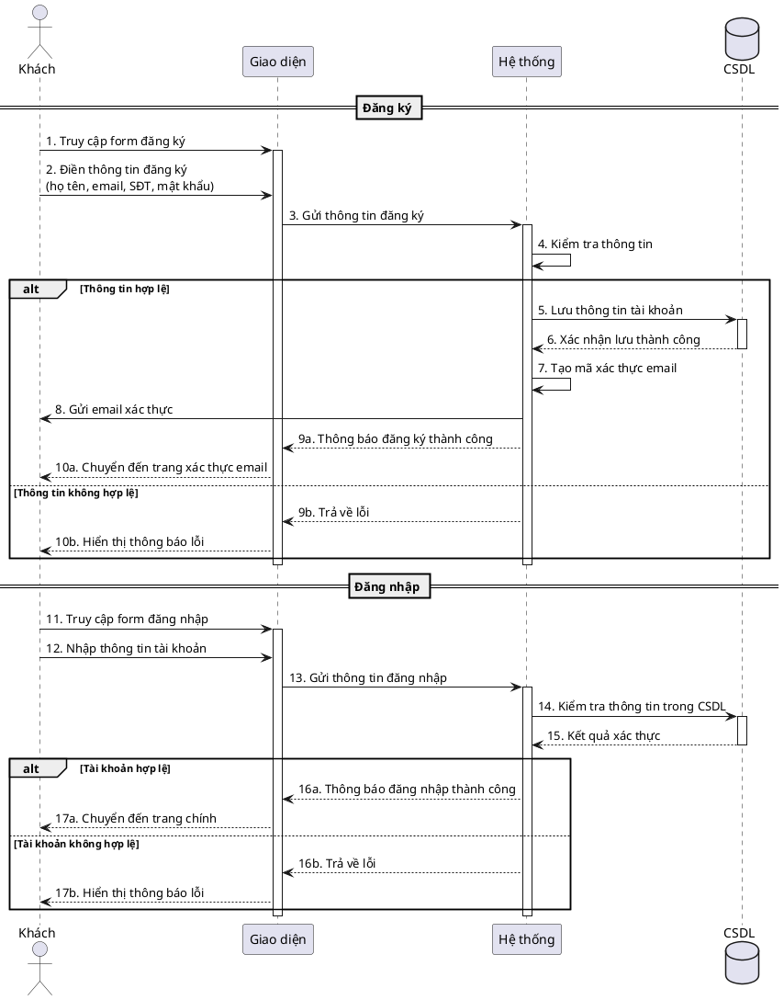


Luồng xử lí học sinh tham gia lễ hội

<details>
  
<summary>Code PlantUML</summary>

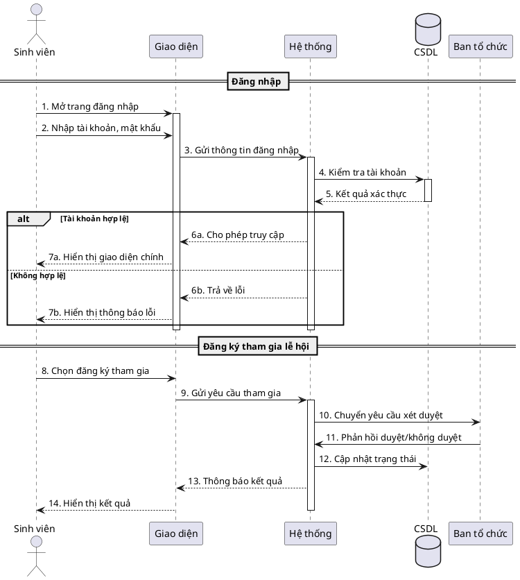
</details> 


Luồng xử lí nhóm đăng kí gian hàng

<details>
  
<summary>Code PlantUML</summary>

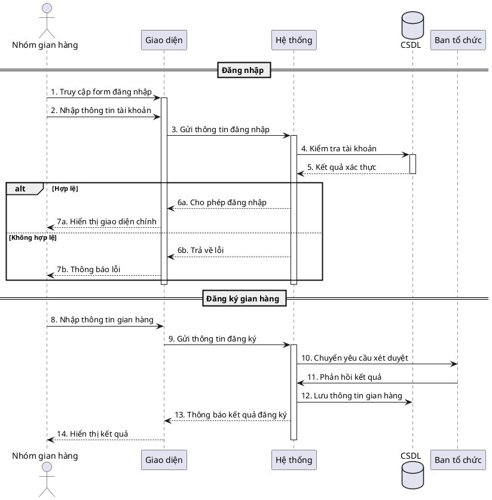
</details> 


Luồng xử lí nhóm giáo viên/nhân viên chấm điểm gian hàng

<details>
  
<summary>Code PlantUML</summary>

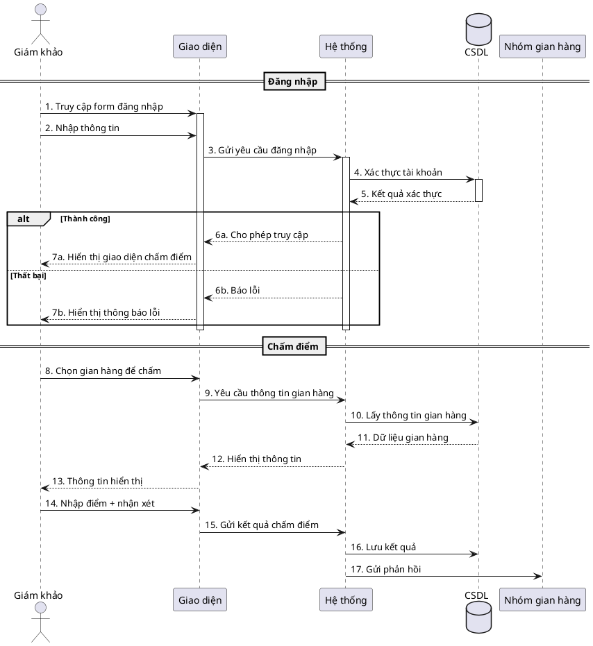
</details> 


Luồng xử lí ban tổ chức quản lí sự kiện

<details>
  
<summary>Code PlantUML</summary>

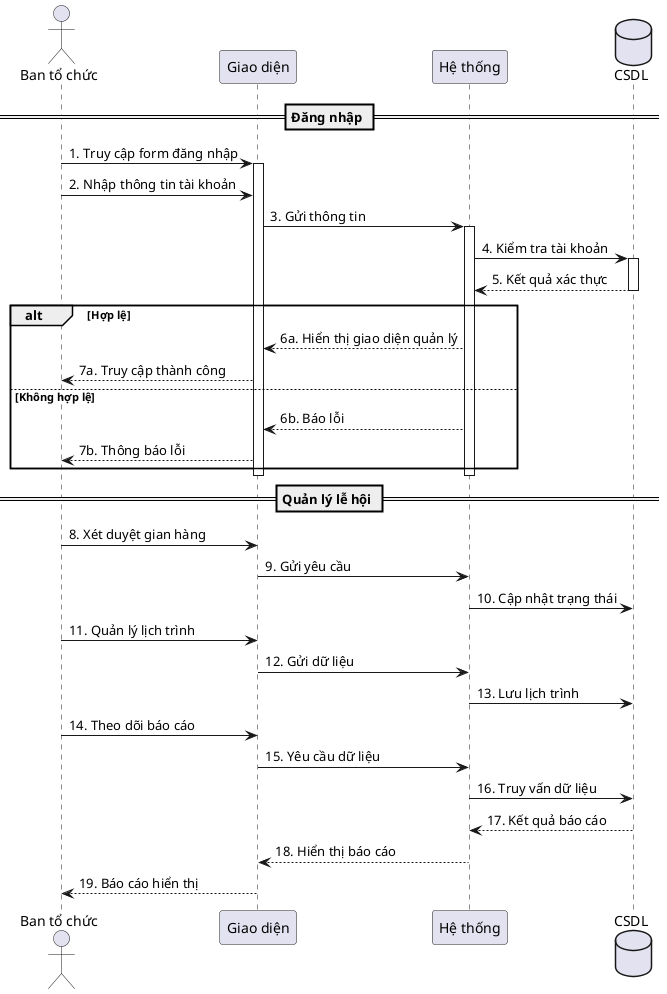
</details> 


Luồng xử lí quản trị viên

<details>
  
<summary>Code PlantUML</summary>

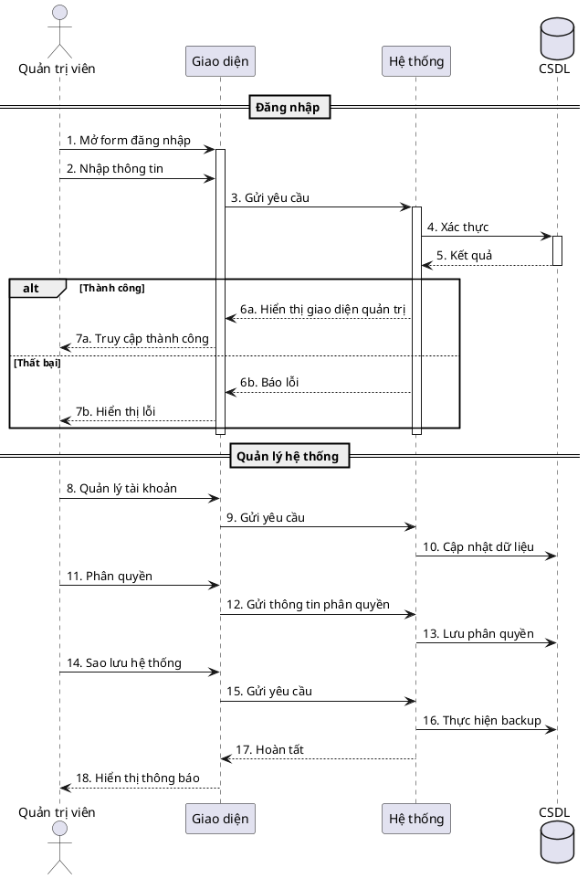
</details> 


### Luồng dữ liệu

<details>
  
<summary>Code PlantUML</summary>

```plantuml
@startuml "DFD cấp 2 - Hệ thống lễ hội ẩm thực"

!define PROCESS circle
!define EXTERNAL_ENTITY rectangle
!define DATA_STORE database

' External entities
EXTERNAL_ENTITY "Guest" as guest
EXTERNAL_ENTITY "Student" as student
EXTERNAL_ENTITY "Team" as team
EXTERNAL_ENTITY "Staff (Giám khảo/GV)" as staff
EXTERNAL_ENTITY "Organizer" as org
EXTERNAL_ENTITY "Admin" as admin

' Main processes
PROCESS "1.0\nQuản lý\nTài khoản" as acc_mgmt
PROCESS "2.0\nĐăng ký\nTham gia" as reg_event
PROCESS "3.0\nQuản lý\nGian hàng" as booth_mgmt
PROCESS "4.0\nĐánh giá\n- Chấm điểm" as eval_mgmt
PROCESS "5.0\nQuản lý\nSự kiện" as event_mgmt
PROCESS "6.0\nCấu hình\nHệ thống" as sys_config

' Data stores
DATA_STORE "D1 Users" as users
DATA_STORE "D2 Registrations" as registrations
DATA_STORE "D3 Booths" as booths
DATA_STORE "D4 Scores" as scores
DATA_STORE "D5 Events" as events
DATA_STORE "D6 Config" as config

' Guest flows
guest --> acc_mgmt : Đăng ký/Đăng nhập
acc_mgmt <--> users : Lưu/Xác thực user

' Student flows
student --> reg_event : Gửi thông tin đăng ký
reg_event <--> registrations : Ghi trạng thái tham gia
reg_event --> org : Yêu cầu phê duyệt

' Team flows
team --> booth_mgmt : Thông tin gian hàng
booth_mgmt <--> booths : Đọc/Ghi gian hàng
org --> booth_mgmt : Xét duyệt gian hàng

' Staff flows
staff --> eval_mgmt : Điểm + nhận xét
eval_mgmt <--> scores : Lưu kết quả
eval_mgmt --> team : Gửi phản hồi

' Organizer flows
org --> event_mgmt : Quản lý lịch trình/Báo cáo
event_mgmt <--> events : Lưu/Truy vấn sự kiện

' Admin flows
admin --> sys_config : Quản trị, phân quyền
sys_config <--> config : Lưu cấu hình hệ thống

@enduml
```
</details> 

![Biểu đồ UML](https://kroki.io/plantuml/svg/eNptVc9rE0EUvu9f8cxFRWu0th6kSGsTo6CtNqu0UAjTzWR3aHY27szW1psU6UEEiydvRhFpsaDgKUE8bPH_2P_E92Y3O2viJTx2vu_9_l6WlWaxTsI-1Br3GuBloy8DmIc5uJ-Nj0AH2fhY-tDPxq8B7Q8CstFJaL7_8GqOc6HLe0JyeLyxvtpst8ETsdfn5efmptvcWFt52GmuuQ_cLYi5p5n0K4jGirvSabvrG03oMs12mOKOcxGa-5rHkvWBSy204MqZdlVrJVzpGjAFPlmzgLZOukg3EJXbsyCXs9AgNBr_88F6PbjUEukwhN0gG32O6q1nlwuf-DZLWY99JsVLHhtQFPuzkJVuKKR5ZmRRwY-YkDCII48rhdVO-lm7ce36tnySYGAJ_fTXtnTTjwIziehL7sLzOqEfasuZJ875u_NDnNyu4QQsBF8wg4-53-F71IyScHM6SEswCUH6UfqGshNFOpgKspAHSYcyQNfpcFvOwSo26EsI58ciGx_mbeV7rD_FXJyO1sZlgl3kHMmCg9lNkW4RaRXdJ5jXNxlsy-qC5vM4UB0vkj3hU0MbuE04oijGblaWrNa4AU8Vj5WhJGT9-zwPG9wXSsdMi0iqScvsl3_hN-EuNUfZPk0BFqDtURJ5it5sPovQpHqVLX0KcAtWTVUGYAs0-w-9fvRCOUYBMDd3p9wGuA12A-qFKXE-ZwOnxCwRw_QA4Q__fE_qm-nQK9RtHihQoaMiVKEkE6xcJaS3svGZQGr6EwNpXObz40l4x-KWCpptJ1EDJMbZaEjMIB2Sm3xhK0wiopgQvpWeJnSoviYwCNJT6CYHuAqaUiU1F3mSng3JLi9yXZufX-64U4EslRRlWpiN33p1SrACpzRmPG-mJ3qSShVsGkhHZNI-soldKsPEMYqBK_mIJOyjN8ciTFb58hSTgt1s9FvDc5JRBUg4U_lkIIPA6Awn-l5QLuV1KvKZ1GI1h1QrTrr8b7wAx0Oiq99NhxF4-ONU8Eslv1wjN04OYA_VKkFZcVN8c_qK2Ob4mehWujY6bsT4zVUa8SeJdWJjX0mnAjRhS5LpiWfvA1VcngfHWeayi39yfwEyFZKw)

### Các trạng thái thực thể trong hệ thống
Trạng thái gian hàng

<details>
  
<summary>Code PlantUML</summary>

```plantuml
@startuml "Biểu đồ trạng thái Gian hàng"
[*] --> DangKy : Tạo mới gian hàng
DangKy --> ChoDuyet : Gửi thông tin
ChoDuyet --> DaDuyet : Ban tổ chức phê duyệt
ChoDuyet --> TuChoi : Bị từ chối
DaDuyet --> HoatDong : Bắt đầu lễ hội
HoatDong --> DaChamDiem : Staff chấm điểm
DaChamDiem --> KetThuc : Sự kiện kết thúc

state DangKy
state ChoDuyet
state DaDuyet
state TuChoi
state HoatDong
state DaChamDiem
state KetThuc

note right of DangKy : Nhóm học sinh đăng ký
note right of ChoDuyet : Đang chờ xét duyệt
note right of DaDuyet : Được phê duyệt
note right of TuChoi : Bị từ chối
note right of HoatDong : Gian hàng đang hoạt động
note right of DaChamDiem : Đã được chấm điểm
note right of KetThuc : Gian hàng kết thúc

TuChoi --> [*]
KetThuc --> [*]
@enduml
```
</details> 


Trạng thái tham gia

<details>
  
<summary>Code PlantUML</summary>

```plantuml
@startuml "Biểu đồ trạng thái suất tham gia"
[*] --> DangKy : Học sinh đăng ký

DangKy --> ChoXacNhan : Gửi yêu cầu
ChoXacNhan --> DaXacNhan : Ban tổ chức chấp nhận
ChoXacNhan --> TuChoi : Bị từ chối

DaXacNhan --> SuDung : Tham gia lễ hội
SuDung --> HoanThanh : Hoàn tất sự kiện

TuChoi --> [*]
HoanThanh --> [*]

state DangKy
state ChoXacNhan
state DaXacNhan
state TuChoi
state SuDung
state HoanThanh

note right of DangKy : Đăng ký mới
note right of ChoXacNhan : Chờ phê duyệt
note right of DaXacNhan : Được duyệt
note right of SuDung : Đang tham gia
note right of HoanThanh : Kết thúc
note right of TuChoi : Không được duyệt
@enduml
```
</details> 


Trạng thái đánh giá


<details>
  
<summary>Code PlantUML</summary>

```plantuml
@startuml "Biểu đồ trạng thái phiếu đánh giá"
[*] --> KhoiTao : Staff mở phiếu

KhoiTao --> DangDanhGia : Điền tiêu chí
DangDanhGia --> HoanTat : Nộp đánh giá
DangDanhGia --> Huy : Bỏ đánh giá

HoanTat --> [*]
Huy --> [*]

state KhoiTao
state DangDanhGia
state HoanTat
state Huy

note right of KhoiTao : Phiếu được tạo
note right of DangDanhGia : Đang chấm điểm
note right of HoanTat : Đã gửi thành công
note right of Huy : Hủy bỏ
@enduml
```
</details> 


Trạng thái tài khoản 


<details>
  
<summary>Code PlantUML</summary>

```plantuml
@startuml "Biểu đồ trạng thái tài khoản"
[*] --> TaoMoi : Đăng ký

TaoMoi --> HoatDong : Được kích hoạt
HoatDong --> Khoa : Vi phạm / Bị khóa
HoatDong --> BiXoa : Người dùng xóa

Khoa --> MoKhoa : Ban tổ chức mở khóa
MoKhoa --> HoatDong

Khoa --> [*]
BiXoa --> [*]

state TaoMoi
state HoatDong
state Khoa
state MoKhoa
state BiXoa

note right of TaoMoi : Tài khoản vừa tạo
note right of HoatDong : Đang hoạt động
note right of Khoa : Tạm khóa
note right of MoKhoa : Được mở khóa lại
note right of BiXoa : Đã xóa
@enduml
```
</details> 


# III. Yêu cầu phi chức năng
## 1. Hiệu suất

* Thời gian tải trang ≤ 3 giây.

* Thời gian phản hồi API ≤ 1 giây.

* Hỗ trợ đồng thời ít nhất 100 người dùng (phù hợp môi trường trường học).

* Tối ưu hóa hình ảnh và tài nguyên tĩnh.

## 2. Bảo mật

* Mã hóa dữ liệu nhạy cảm (thông tin tài khoản, phản hồi).

* Bảo vệ chống các tấn công như SQL Injection

* Ghi log đầy đủ các hành động quan trọng (đăng nhập, đăng ký gian hàng, chấm điểm).

* Backup dữ liệu định kỳ (hằng ngày).

## 3. Khả năng mở rộng

* Kiến trúc module hóa, dễ thêm tính năng mới (ví dụ: mini game, bình chọn).

* Khả năng tích hợp với hệ thống trường học (portal sinh viên, LMS).

* Dễ dàng nâng cấp phiên bản.

* Có tài liệu API & hướng dẫn đầy đủ cho developers.

## 4. Giao diện người dùng

* Thiết kế responsive cho mọi thiết bị (máy tính, tablet, mobile).

* Thời gian học sử dụng ≤ 30 phút (phù hợp học sinh & giáo viên).

* Giao diện thống nhất & thân thiện, màu sắc trẻ trung.

## 5. Tương thích

* Hoạt động tốt trên trình duyệt phổ biến (Chrome, Firefox, Safari, Edge).

* Tương thích iOS & Android khi truy cập từ mobile.

* Hỗ trợ trình duyệt phát hành trong 2 năm gần đây.

* Tối ưu cho mạng chậm 
## 6. Độ tin cậy

* Đảm bảo Uptime ≥ 99.9% trong thời gian diễn ra lễ hội.

* Thời gian phục hồi sau sự cố < 4 giờ.

* Backup dữ liệu tự động hàng ngày.

* Có phương án dự phòng (ví dụ: truy cập offline bằng Excel/PDF xuất từ hệ thống).

## 7. Khả năng bảo trì

* Code viết theo chuẩn Clean Code 

* Có tài liệu kỹ thuật chi tiết cho từng module.

* Hỗ trợ rollback khi deploy thất bại.

# IV. Công nghệ

* Frontend: ReactJS → xây dựng giao diện người dùng.

* Backend: Flask (Python) → phát triển dịch vụ API.	

* API: Chuẩn REST API (có thể mở rộng GraphQL sau này).

* Cơ sở dữ liệu: MS SQL Server (lưu thông tin tài khoản, gian hàng, món ăn, phản hồi, điểm số).

* Bảo mật: Xác thực & phân quyền bằng JWT.

* Thông báo: Email (thông báo duyệt gian hàng, kết quả chấm điểm).

* Triển khai: Docker 

* Quản lý mã nguồn: Git + GitHub

# V. Yêu cầu thiết kế
Mô hình kiến trúc

Hệ thống sử dụng kiến trúc 3 lớp (Three-Tier Architecture):

* Client (Frontend)

Xây dựng bằng ReactJS.

Học sinh, giáo viên, ban tổ chức đăng nhập và thao tác qua giao diện web/mobile.

Gửi request đến API, hiển thị kết quả.

* Server (Backend - Flash API Python)

Presentation Layer: Tiếp nhận request từ client, xác thực người dùng, gọi service.

Business Logic Layer (Service Layer): Xử lý nghiệp vụ (xét duyệt gian hàng, quản lý suất tham gia, chấm điểm).

Data Access Layer (Repository): Tương tác CSDL, thực hiện CRUD.

* Database

MSSQL.

Lưu trữ dữ liệu như:

Tài khoản người dùng (Admin, Ban tổ chức, Giáo viên, Nhóm học sinh, Học sinh).

Gian hàng (thông tin, chi phí, doanh thu).

Phản hồi & đánh giá.

Lịch trình lễ hội.

Kết quả xếp hạng.

<details>
  
<summary>Code PlantUML</summary>

```plantuml
@startuml "Mô hình kiến trúc"

package "Client" {
    [ReactJS]
}

package "Server" {
    [Controller]
    [Service]
    [Repository]
}

database "Database" {
    [MS SQL Server]
}

[ReactJS] <--> [Controller] : REST API
[Controller] <--> [Service]
[Service] <--> [Repository]
[Repository] <--> [MS SQL Server]

@enduml
```
</details> 


## Mô hình cơ sở dữ liệu 

Cơ sở dữ liệu – School Food Festival

Cơ sở dữ liệu sẽ bao gồm các bảng sau:

1. **Users**: Lưu thông tin người dùng của hệ thống, bao gồm tên đăng nhập, email, mật khẩu, vai trò (học sinh, giáo viên, ban tổ chức, quản trị viên...).

2. **Students (HocSinh)**: Lưu thông tin học sinh tham gia lễ hội, bao gồm họ tên, lớp học.

3. **Classes (LopHoc)**: Lưu thông tin các lớp học, là đơn vị để lập gian hàng.

4. **Events (SuKien)**: Lưu thông tin sự kiện lễ hội ẩm thực, bao gồm tên sự kiện, địa điểm tổ chức.

5. **Booths (GianHang)**: Lưu thông tin gian hàng của các lớp, bao gồm tên gian hàng, mô tả, trạng thái duyệt, vị trí trong sự kiện.

6. **BoothMembers (ThanhVienGianHang)**: Quản lý danh sách học sinh thuộc gian hàng, bao gồm vai trò trong nhóm (trưởng nhóm, phục vụ, thu ngân...).

7. **Foods (MonAn)**: Lưu thông tin các món ăn mà gian hàng cung cấp, bao gồm tên món ăn, giá bán.

8. **Votes (BinhChon)**: Lưu thông tin bình chọn món ăn từ người dùng, liên kết giữa người dùng và món ăn.

9. **Reviews (DanhGia)**: Lưu đánh giá của người dùng đối với gian hàng, bao gồm điểm số và bình luận.

10. **Transactions (GiaoDich)**: Ghi nhận các giao dịch tài chính của gian hàng (thu/chi, số tiền).


<details>
  
<summary>Code PlantUML</summary>

```plantuml
@startuml "ERD - School Food Festival"

entity NguoiDung {
  *NguoiDungID : int <<PK>>
  TenDangNhap : string
  MatKhau : string
  Email : string
  VaiTro : string
}

entity HocSinh {
  *HocSinhID : int <<PK>>
  LopHocID : int <<FK>>
  HoTen : string
}

entity LopHoc {
  *LopHocID : int <<PK>>
  TenLopHoc : string
}

entity SuKien {
  *SuKienID : int <<PK>>
  TenSuKien : string
  DiaDiem : string
}

entity GianHang {
  *GianHangID : int <<PK>>
  LopHocID : int <<FK>>
  SuKienID : int <<FK>>
  TenGianHang : string
  MoTa : string
  TrangThaiDuyet : string
  ViTri : string
}

entity ThanhVienGianHang {
  *ThanhVienID : int <<PK>>
  HocSinhID : int <<FK>>
  GianHangID : int <<FK>>
  VaiTroTrongNhom : string
}

entity MonAn {
  *MonAnID : int <<PK>>
  GianHangID : int <<FK>>
  TenMonAn : string
  GiaBan : decimal
}

entity BinhChon {
  *BinhChonID : int <<PK>>
  NguoiDungID : int <<FK>>
  MonAnID : int <<FK>>
}

entity DanhGia {
  *DanhGiaID : int <<PK>>
  NguoiDungID : int <<FK>>
  GianHangID : int <<FK>>
  DiemSo : int
  BinhLuan : string
}

entity GiaoDich {
  *GiaoDichID : int <<PK>>
  GianHangID : int <<FK>>
  LoaiGiaoDich : string
  SoTien : decimal
}

SuKien ||--o{ GianHang
LopHoc ||--o{ HocSinh
LopHoc ||--o{ GianHang
HocSinh ||--o{ ThanhVienGianHang
GianHang ||--o{ ThanhVienGianHang
GianHang ||--o{ MonAn
NguoiDung ||--o{ BinhChon
MonAn ||--o{ BinhChon
NguoiDung ||--o{ DanhGia
GianHang ||--o{ DanhGia
GianHang ||--o{ GiaoDich

@enduml
```
</details> 


# Giao diện người dùng.

Giao diện người dùng sẽ bao gồm các trang sau:

1. Trang chủ: Hiển thị thông tin về lễ hội ẩm thực, sự kiện đang diễn ra, gian hàng nổi bật và món ăn được yêu thích.

2. Trang gian hàng: Hiển thị danh sách các gian hàng theo lớp, cho phép tìm kiếm, lọc theo tiêu chí (món ăn, giá, vị trí...) và xem chi tiết gian hàng.

3. Trang món ăn: Hiển thị danh sách các món ăn, cho phép người dùng xem chi tiết, giá, và gian hàng cung cấp.

4. Trang bình chọn & đánh giá: Cho phép người dùng bình chọn món ăn, đánh giá gian hàng, và xem kết quả xếp hạng theo thời gian thực.

5. Trang cá nhân: Hiển thị thông tin tài khoản người dùng, cho phép cập nhật thông tin, đổi mật khẩu, xem lịch sử bình chọn/đánh giá.

6. Trang quản lý:

* Ban tổ chức: Duyệt gian hàng, theo dõi sự kiện, thống kê kết quả.

* Giáo viên/nhân viên: Giám sát, chấm điểm gian hàng.

* Quản trị viên: Quản lý người dùng, gian hàng, sự kiện, dữ liệu hệ thống.


