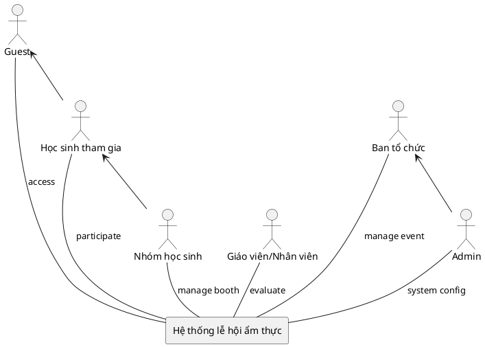
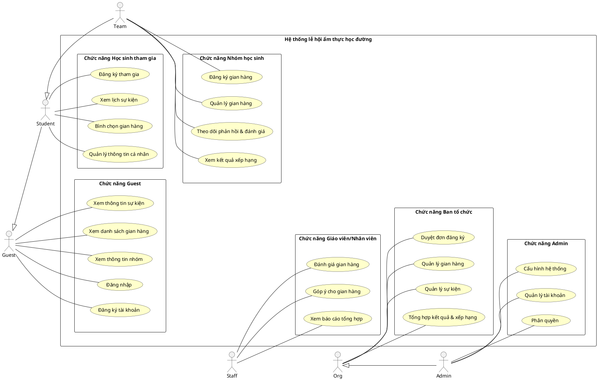
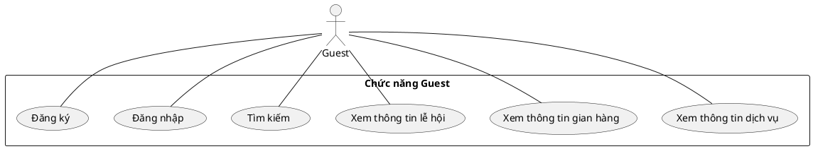
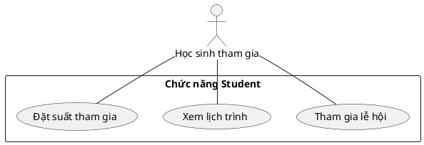
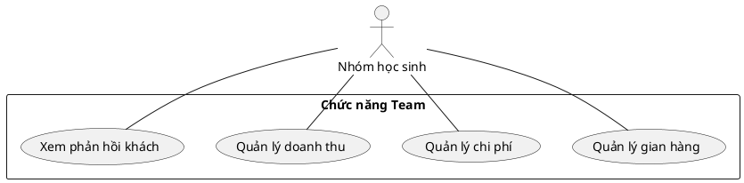
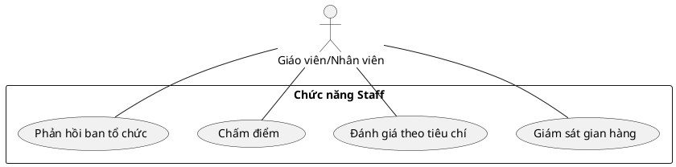
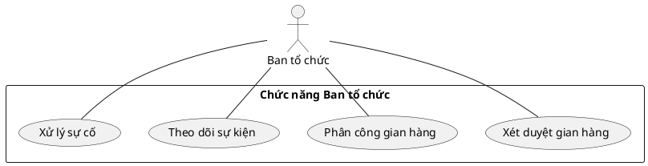
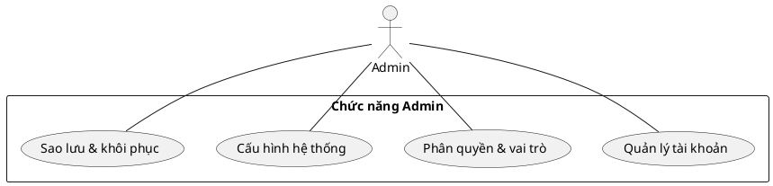

# CNPM-school-food-festivals

## Sơ đồ hệ thống

### 1. Context Diagram

### 2. ERD Diagram

### 3. Use Case Diagram

# I. Tổng quan dự án

## Mục tiêu

Xây dựng một **website/app** phục vụ công tác tổ chức **lễ hội ẩm thực học đường** tại trường, cho phép học sinh/nhóm học sinh đăng ký gian hàng & tham gia sự kiện, ban tổ chức quản lý – xét duyệt – phân công – theo dõi tiến độ, giáo viên/nhân viên hỗ trợ giám sát/đánh giá, và admin vận hành hệ thống. Hệ thống cũng hỗ trợ thu thập phản hồi, chấm điểm – xếp hạng gian hàng, báo cáo tổng hợp sau sự kiện.

## Phạm vi

Phạm vi bao gồm các chức năng chính:

* **Quản lý sự kiện** (tạo/sửa/xoá sự kiện, cấu hình thời gian – khu vực – tiêu chí chấm điểm, mini game/đổi thưởng nếu có).
* **Đăng ký tham gia** (đăng ký người tham gia, **đăng ký gian hàng** với mô tả món, nhu cầu dụng cụ/nguyên liệu, số lượng thành viên…).
* **Xét duyệt** (duyệt/ từ chối đăng ký, phản hồi yêu cầu bổ sung, phân công khu vực, theo dõi tiến độ chuẩn bị).
* **Quản lý gian hàng** (cập nhật thông tin, nhập nguyên liệu, theo dõi chi phí, ghi nhận doanh thu, tồn kho đơn giản).
* **Tương tác – truyền thông** (xem thông tin sự kiện, thông báo, lịch, bản đồ gian hàng, mini game/bình chọn công khai…).
* **Bình chọn – đánh giá – phản hồi** (bình chọn của học sinh/khách, phiếu chấm điểm của giáo viên/BTC, phản hồi hai chiều).
* **Báo cáo – xếp hạng** (bảng điểm, top gian hàng theo tiêu chí, lãi/lỗ, thống kê tham gia, nhật ký hoạt động).
* **Quản trị hệ thống** (quản lý tài khoản, phân quyền vai trò, cấu hình tiêu chí, danh mục dịch vụ/dụng cụ mặc định, sao lưu dữ liệu).

## Giả định và ràng buộc

* Hệ thống phục vụ **một trường** hoặc **sự kiện nội bộ** của trường; không nhằm thay thế ERP/CRM quy mô lớn.
* **Không tích hợp thanh toán online**; doanh thu/chi phí do nhóm tự ghi nhận (input thủ công).
* Xét duyệt, phân công và cập nhật tiến độ có thể được **thực hiện thủ công** bởi Ban tổ chức qua giao diện quản trị.
* Hệ thống ưu tiên **web-first**, hỗ trợ mobile responsive; ứng dụng di động là tuỳ chọn.
* Bảo mật ở mức **tài khoản – vai trò**; không xử lý dữ liệu nhạy cảm ngoài phạm vi sự kiện (KHÔNG lưu CMND/CCCD, số tài khoản…).
* Tối ưu cho **tải vừa** (hàng nghìn người dùng nội bộ/truy cập cùng lúc ở mức trung bình khi diễn ra sự kiện).

---

# II. Yêu cầu chức năng

## Các tác nhân (Actor)

Hệ thống có **5 tác nhân** chính:

1. **Guest** (khách/HS chưa đăng nhập) – xem thông tin sự kiện, gian hàng, tham gia bình chọn/mini game (nếu cho phép ẩn danh).
2. **Học sinh tham gia (Customer)** – cá nhân tham dự sự kiện, có thể bình chọn, đăng ký tham gia cá nhân, nhận thông báo.
3. **Nhóm học sinh (Stylist)** – đại diện gian hàng/nhóm thi: quản lý gian hàng, chi phí, doanh thu, tiến độ, phản hồi.
4. **Ban tổ chức trường (Manager)** – xét duyệt, phân công, theo dõi, quản lý sự kiện toàn cục.
5. **Giáo viên/Nhân viên** – giám sát, chấm điểm theo tiêu chí, phản hồi hiện trường.
6. **Admin** – quản trị hệ thống (tài khoản, vai trò, cấu hình, sao lưu).
   *(Ghi chú: Có thể gộp Admin vào Ban tổ chức nếu tổ chức nhỏ.)*

### Code PlantUML (actor diagram)

  

Code PlantUML

 

## Các chức năng chính

### Guest

* **Tìm kiếm & xem thông tin sự kiện/gian hàng** (mô tả, thời gian, địa điểm, bản đồ gian hàng, nội quy, lịch).
* **Xem bảng xếp hạng/bình chọn công khai** (nếu sự kiện cho phép).
* **Tham gia mini game, bình chọn** (nếu cho phép không đăng nhập hoặc OTP/email xác thực nhanh).
* **Đăng ký/Đăng nhập** để tham gia sâu hơn.

### Học sinh tham gia (Customer)

* **Đăng ký tham gia cá nhân** sự kiện (nhận mã/QR, nhận thông báo).
* **Bình chọn** gian hàng, gửi **phản hồi** cho BTC.
* **Xem lịch sự kiện**, lịch biểu diễn/hoạt động, **nhận thông báo**.
* **Quản lý tài khoản** (cập nhật thông tin, đổi mật khẩu).

### Nhóm học sinh (Team)

* **Đăng ký gian hàng**: thông tin nhóm, món ăn, nhu cầu dụng cụ/nguyên liệu, công suất phục vụ.
* **Cập nhật tiến độ chuẩn bị**: checklist công việc, minh chứng.
* **Quản lý gian hàng**: mô tả, hình ảnh, menu/giá (nếu có), vị trí gian hàng.
* **Ghi nhận doanh thu – chi phí**; **xem lãi/lỗ** cơ bản.
* **Nhập nguyên liệu** & tồn kho đơn giản (tuỳ chọn).
* **Nhận phản hồi** từ BTC/GV, trả lời phản hồi.

### Giáo viên/Nhân viên

* **Xem thông tin sự kiện & phân công**.
* **Chấm điểm** gian hàng theo **bộ tiêu chí** (thang điểm, trọng số) – online/offline.
* **Ghi nhận vi phạm/biên bản** nếu cần.
* **Gửi phản hồi**/đề xuất hỗ trợ cho BTC.

### Ban tổ chức (Manager)

* **Tạo & cấu hình sự kiện**: thời gian, địa điểm, sơ đồ gian hàng, tiêu chí chấm điểm, cấu hình bình chọn/mini game.
* **Xét duyệt** đăng ký tham gia, đăng ký gian hàng; **phản hồi** yêu cầu bổ sung.
* **Phân công** khu vực, lịch trực, nhiệm vụ; **theo dõi tiến độ** các nhóm.
* **Quản lý danh sách** người tham gia; **gửi thông báo** đa kênh (email/app push/QR).
* **Quản lý bình chọn**: thời gian mở/đóng, phát hiện gian lận cơ bản (giới hạn tần suất/IP/OTP).
* **Báo cáo & Xếp hạng**: tổng hợp điểm BGK + bình chọn, bảng xếp hạng theo tiêu chí, export Excel/PDF.

### Admin

* **Quản lý tài khoản & vai trò** (Admin/BTC/Staff/Team/Student/Guest hạn chế).
* **Quản lý danh mục** (tiêu chí chấm điểm mặc định, danh mục dụng cụ/nguyên liệu tham khảo).
* **Cấu hình hệ thống** (logo, tên sự kiện, email server, sao lưu/khôi phục dữ liệu).
 
### Biểu đồ Use Case tổng quanquan

  

Code PlantUML

 

![Biểu đồ UML](https://www.plantuml.com/plantuml/png/bLR1Zjn44BtxAqfxI4uZVe13TcPd9qXX2JC9Ga8SEkqUTyjsjzTk3wmW1uGG1uH4X3WWX9GXuX040XIup0Xny8h_y9_GNPvjQXtFCfd3RlkvNtNLg-egtwaiAssTPr6LAbsmakLGLuApIi174S2OyJGfJQtZYSbC2UE7YpVEfej5z3WY36tiyFPxAf5saLwCirfuIYQM5go1qkCGgr9mguoE8iQjspwhHMLtwuMjOw6ldXu8beSNRBdShTygaztgECwLiuCMuFMFHwDWeFk_0z6EO-7J5SbxmNII2JYwssu_1olRxHETGDPkFmEt_bP1ktcU8_uxzyYN72wV_FDRk_rU9qSkyWZSpvf4M2bALABx4SiJHtlEGLz-gfCkq2DW5Ho7tVWBuX-zA_o1pHzkjrKQAdSqfCgvfv7tZX8VJ5T2s_tic6a9LRFc4XB5DCZcgKu2UMoCbTL1PslPlCW3qKkuXtVv5KQdPRlvfK32FPCeVUFcjFaBRFDKGIfDktdMHJSNYQgiA0FpSVI_cjx5j5HAIx2IvJvcj3NUfp1rW19s1KDz69R8rSSNN0wcPi6bYEjC39F7pSzQ0lU5f5_AZR42SpDCVRls8a66JeSCyMRji_H3vy2RJBD4t2_DKcM2I1Y4t2_YcKyro20bsfi41GVLen7GvD4eXYEWnE3t7je3AGp4pPyA2ea6d9DVAxZbBcAprhx4ctMG_rI8-17ZQJIOjxJT_6tXtFi17xfr0SxYcjoDETEfqiaXWitSiGPMglb9ltRcCz2jqTJ9i6x1tNxyqnNBQcRtAJ1hNXJWLEFIz9apjH8tn_p8kydz7zjklz69b-zPyL_4eZ2bhGw9UCmqsW2EQEVvKAGdzOMx4zPtohLsVw_gfUjxHL6QbPYBSzyAgrSf4zU-IQNSJEtVpOv86oSjCQBCjIAvzNAPBEeyP-N5N5HrTfXkE6oGUpgargJT_5Y3nCuWoHJgJhkehCWdHYzLScEyj9EIW8yvDxKUala-rkovJzKdb34tcRWMrcsOEHb_lJAU0EycYmSPFa3gFLQu-nX6xqaLnqA_Fu89GXCAdI1qGg4fGbCAdKRkyDlEew9GNa6SzAjs-vs2XyxvYOjWD_578p8H2HJc7CLmX16e6rBXCJJ-yEdWmFvG8AzelwTuwEG4xFNco7j2pyJz0ILb7Z3QtYWOcbQ47qWExVMJ05zh5W6bNG2_a1pMlwGTtBk00QPtguFwjoJ2Eu0lQ447j5Ui50ybUKVekCwpVm40)

### Biểu đồ Use Case chi tiết
#Chức năng Guest

  

Code PlantUML

 

#Chức năng Student

  

Code PlantUML

 

#Chức năng Student

  

Code PlantUML

 

#Chức năng Staff

  

Code PlantUML

 

#Chức năng Org

  

Code PlantUML

 

#Chức năng Admin

  

Code PlantUML

 

